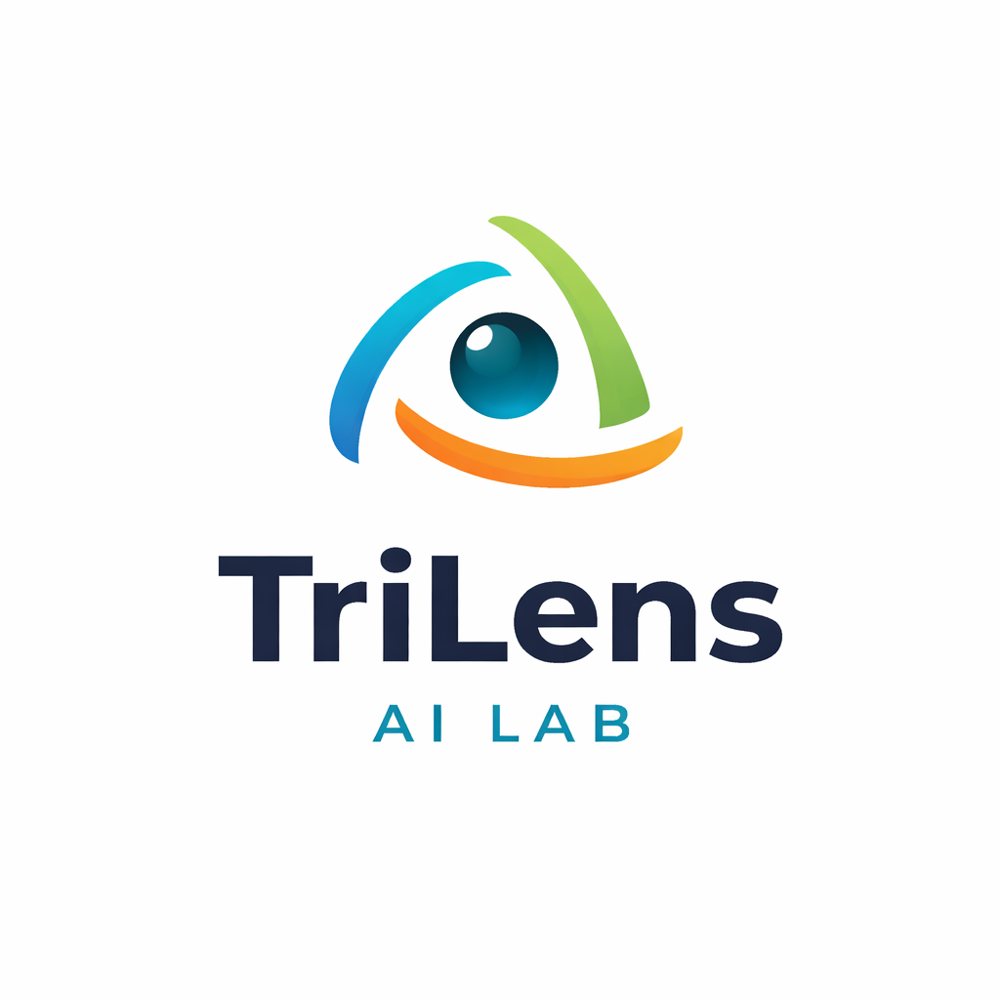

# TriLens.ai Website

A modern, responsive static website for TriLens.ai - showcasing AI data labeling and annotation services.

## 🌟 Features

- **Fully Responsive**: Works seamlessly on iOS, Android, and web browsers
- **Modern Design**: Clean, professional interface with smooth animations
- **Fast Loading**: Optimized static site with minimal dependencies
- **SEO Friendly**: Proper meta tags and semantic HTML structure
- **Mobile-First**: Designed with mobile devices as the primary focus

## 📁 Project Structure

```
trilens/
├── index.html          # Main HTML file
├── styles.css          # All styling and responsive design
├── script.js           # JavaScript for interactivity
├── images/             # Images directory
│   └── README.md       # Image placement guide
└── README.md           # This file
```

## 🚀 Quick Start

### Local Development

1. Simply open `index.html` in your web browser:
   ```bash
   open index.html
   ```

2. Or use a local server (recommended):
   ```bash
   # Using Python 3
   python3 -m http.server 8000
   
   # Using Node.js (if you have http-server installed)
   npx http-server
   ```

3. Visit `http://localhost:8000` in your browser

## 🌐 Deployment Options

### Option 1: GitHub Pages (Free)

1. Create a new repository on GitHub
2. Push your code:
   ```bash
   git init
   git add .
   git commit -m "Initial commit"
   git branch -M main
   git remote add origin https://github.com/yourusername/trilens.git
   git push -u origin main
   ```
3. Go to repository Settings > Pages
4. Select "main" branch as source
5. Your site will be live at `https://yourusername.github.io/trilens/`

### Option 2: Netlify (Free, with custom domain)

1. Install Netlify CLI:
   ```bash
   npm install -g netlify-cli
   ```

2. Deploy:
   ```bash
   netlify deploy --prod
   ```

3. Follow the prompts to link your domain `trilens.ai`

**Or use Netlify's drag-and-drop:**
- Go to [netlify.com](https://netlify.com)
- Drag the entire `trilens` folder onto the deploy area
- Configure custom domain in settings

### Option 3: Vercel (Free, excellent performance)

1. Install Vercel CLI:
   ```bash
   npm install -g vercel
   ```

2. Deploy:
   ```bash
   vercel
   ```

3. Follow prompts to configure domain

### Option 4: AWS S3 + CloudFront

1. Create an S3 bucket named `trilens.ai`
2. Enable static website hosting
3. Upload all files to the bucket
4. Set up CloudFront distribution
5. Configure Route 53 for DNS

### Option 5: Traditional Web Hosting

Upload all files via FTP/SFTP to your web hosting provider's public_html or www directory.

## 🎨 Customization

### Update Colors

Edit the CSS variables in `styles.css`:

```css
:root {
    --primary-color: #2563eb;        /* Main brand color */
    --primary-dark: #1e40af;         /* Darker variant */
    --secondary-color: #7c3aed;      /* Secondary accent */
    /* ... */
}
```

### Add Your Logo

1. Place your logo in the `images/` folder
2. Update `index.html`:
   ```html
   <a href="#home" class="logo">
       
   </a>
   ```

### Update Content

- **Company Info**: Edit text in `index.html` sections
- **Services**: Modify the `.service-card` elements
- **Stats**: Update numbers in the `.stat-item` elements
- **Contact**: Add your real email addresses

### Connect Contact Form

The contact form currently shows an alert. To connect it to a backend:

1. **Using Formspree** (easiest):
   ```html
   <form action="https://formspree.io/f/YOUR_FORM_ID" method="POST">
   ```

2. **Using Netlify Forms**:
   ```html
   <form name="contact" method="POST" data-netlify="true">
   ```

3. **Custom Backend**: Update the fetch call in `script.js`

## 📱 Browser Compatibility

- ✅ Chrome (latest)
- ✅ Firefox (latest)
- ✅ Safari (latest)
- ✅ Edge (latest)
- ✅ iOS Safari 12+
- ✅ Android Chrome

## 🔧 Technologies Used

- **HTML5**: Semantic markup
- **CSS3**: Modern styling with CSS Grid and Flexbox
- **Vanilla JavaScript**: No frameworks required
- **Google Fonts**: Inter font family

## 📊 Performance

- **No external dependencies** (except Google Fonts)
- **Optimized CSS** with efficient selectors
- **Lazy loading** for animations
- **Minimal JavaScript** for fast load times

## 🔒 Security

- No backend required for static hosting
- Use HTTPS (free with most hosting providers)
- Add CSP headers for additional security

## 📝 SEO Checklist

- [x] Semantic HTML structure
- [x] Meta description tag
- [x] Proper heading hierarchy (H1, H2, H3)
- [ ] Add Open Graph tags for social sharing
- [ ] Create sitemap.xml
- [ ] Add robots.txt
- [ ] Set up Google Analytics
- [ ] Submit to Google Search Console

## 🎯 Next Steps

1. **Add your logo** to the `images/` folder
2. **Customize colors** to match your brand
3. **Update contact information** with real emails
4. **Connect contact form** to your backend/service
5. **Add analytics** (Google Analytics, Plausible, etc.)
6. **Set up custom domain** (trilens.ai)
7. **Add SSL certificate** (usually automatic with hosting)
8. **Test on real devices** (iOS and Android)

## 📄 License

Copyright © 2024 TriLens.ai. All rights reserved.

## 🤝 Support

For questions or support, contact: info@trilens.ai

---

**Built with ❤️ for TriLens.ai**
